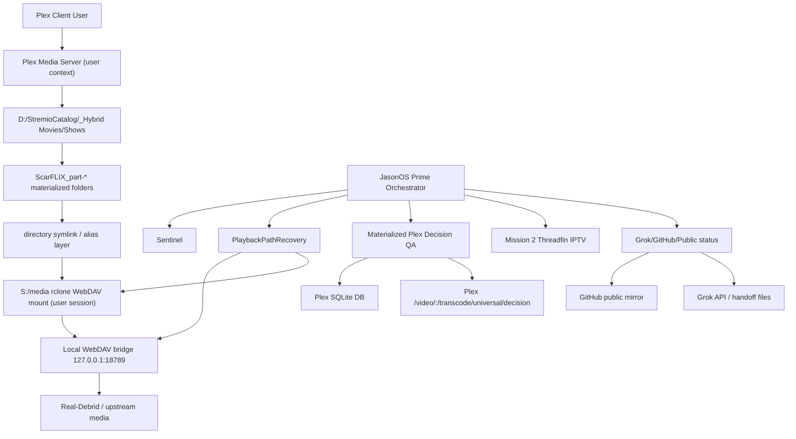

# JasonOS Prime / ScarFLIX As-Built Architecture, Blockers, and Congestion Handoff

Updated UTC: 2026-06-13T13:45:00Z  
Audience: Claude AI, Grok, Codex, and future engineering review  
Purpose: provide a complete current-state handoff for architecture review, blocker analysis, and alternative solution design.

## Executive Summary

JasonOS Prime / ScarFLIX is a Plex-first automation stack intended to provide a Stremio-like experience inside Plex, using Real-Debrid/WebDAV-backed materialized media paths, automated quality gates, playback-first protections, and public/Grok-visible status reporting.

The project is not yet go-live ready. The system is currently stable enough to run a 16-hour local go-live campaign runner, but ScarFLIX publication and broad expansion remain blocked by Materialized Plex Decision QA failures. The current blocker is no longer a wrapper crash: it is real Plex decision/playback instability and incomplete Plex DB row coverage for materialized `ScarFLIX_part-*` paths.

Current verified high-level state:

- Plex is running and reachable.
- Active Plex sessions: `0` in the latest go-live campaign cycle.
- Sentinel: `PASS / LOW`.
- `PAUSE_PUBLICATION`: active.
- Broad expansion and publication: not allowed.
- Mission 2 IPTV Threadfin virtual adapter: reachable and ready for later Plex attach.
- Go-live campaign runner: active for 16 hours with bounded QA batches and self-throttling.
- Materialized QA: `REVIEW`, latest bounded batch checked `3`, passed `2`, failed `1`.
- Plex DB row discovery: `229` materialized targets discovered, `94` Plex DB rows found, `89` decision-probe candidates.
- Recent failure mode: Plex decision endpoint returns `socket hang up` / timeout for some materialized items while others pass HTTP 200.

The most useful external review target is: how to redesign or improve the Plex decision/playback validation path and reduce resource pressure while preserving Plex as the front end and preventing unsafe catalogue expansion.

## Current Outcome Status

| Outcome | Current Status | Evidence | Blocker |
|---|---|---|---|
| Plex playback first | Infrastructure PASS, user confirmation still needed | Playback guard, PlexWatchdog, PlaybackPathRecovery active; Plex identity HTTP 200 | Real user playback has recently been hit-and-miss |
| ScarFLIX movies/TV playable in Plex | REVIEW_NOT_GO_LIVE_READY | Materialized QA bounded batches show mixed pass/fail | Plex decision failures and missing Plex DB rows |
| IPTV-only Live TV | PASS_VIRTUAL_ADAPTER_READY_PLEX_ATTACH_PENDING | Threadfin virtual adapter reachable; 4 channels verified | Plex Live TV/DVR attach not executed yet |
| Command Centre / AI | REVIEW but improved | CommandCentre and DailyAI reported PASS in readiness evidence | Needs end-user usability pass |
| Public dashboard / Grok | PASS_OPERATIONAL | Public mirror/Grok delivery reported operational | Full mirror can be heavy; quick-push now exists |
| Autonomous operation | Improving | 16-hour campaign runner active, singleton locked | Needs proof over time and no-progress loop handling |
| Go-live control | Installed | Readiness ledger exists | ScarFLIX catalogue blocker remains |

## System Architecture As Built

### Key Design Decisions

- Plex remains the required playback front end.
- Production Plex runs in the normal user profile context, not as a LocalSystem NSSM service by default.
- `S:\media` is a user-session rclone mount and is not reliably visible from LocalSystem/service contexts.
- The immediate Plex availability solution is a user-context watchdog, not LocalSystem service conversion.
- Production Plex is playback-priority, not scan-priority.
- `PAUSE_PUBLICATION` remains mandatory until Materialized QA returns to PASS.
- Legacy direct resolver publication remains disabled.
- The primary ScarFLIX delivery model is materialized/WebDAV-backed `ScarFLIX_part-*` paths.
- Second Plex/Docker staging is design-allowed only as an isolated future staging/indexing lane, not as a shared production DB writer.
- Mission 2 TV is IPTV-only via Threadfin virtual adapter. No physical tuner will be used.

## Main Components and Responsibilities

| Component | Location | Responsibility | Current Role |
|---|---|---|---|
| Plex Media Server | `C:\Program Files\Plex\Plex Media Server` | Playback front end, library metadata, decisions | Production playback runtime |
| Hybrid libraries | `D:\StremioCatalog\_Hybrid\Movies`, `D:\StremioCatalog\_Hybrid\Shows` | Plex-visible materialized catalogue | Current ScarFLIX surface |
| WebDAV bridge | `D:\PlexTools\Scripts\scarflix_v2\scarflix_v2_webdav_file_bridge_node.js` | Local HTTP media bridge | Playback path dependency |
| rclone mount | `S:\media` | Local filesystem presentation over WebDAV | Required for Plex local path resolution |
| PlexWatchdog | `D:\PlexTools\Foundry\workers\JasonOS_Prime_PlexWatchdog.js` | Start Plex if absent, never kill running Plex | Keep Plex available |
| PlaybackPathRecovery | `D:\PlexTools\Scripts\scarflix_v2\JasonOS_Prime_PlaybackPathRecovery.ps1` | Recover WebDAV/rclone/Plex identity path | Playback-first self-heal |
| PlaybackFirstStabilityGuard | `D:\PlexTools\Scripts\scarflix_v2\JasonOS_Prime_PlaybackFirstStabilityGuard.ps1` | Suppress scanner/analyzer during playback/off-peak | Playback contention reduction |
| Materialized QA Node | `D:\PlexTools\Foundry\workers\ScarFLIX_v2_MaterializedPlexDecisionQA_Node.js` | Match materialized paths to Plex DB and decision endpoint | Main go-live blocker detector |
| 16h Campaign Runner | `D:\PlexTools\Foundry\workers\JasonOS_Prime_GoLive16hCampaignRunner.js` | Bounded progress loop for exclusive Plex window | Active |
| Sentinel | `D:\PlexTools\Foundry\workers\JasonOS_Prime_Sentinel.js` | Watchdog-of-watchdog safety monitor | PASS/LOW |
| Public mirror | `D:\PlexTools\Foundry\workers\JasonOS_Prime_PublicMirrorPublisher.js` | Broad GitHub status mirror | Can be heavy |
| Quick push | `D:\PlexTools\Foundry\workers\JasonOS_Prime_PublicMirrorQuickPush.js` | Narrow GitHub status push | Preferred during sensitive windows |
| Threadfin | Docker container / port `35400` | IPTV virtual Plex-compatible adapter | Verified reachable |

## Current 16-Hour Campaign Runner

Runner:

- `D:\PlexTools\Foundry\workers\JasonOS_Prime_GoLive16hCampaignRunner.js`
- Task: `JasonOS_Prime_GoLive16hCampaignRunner`
- Status: `D:\PlexTools\public\latest\scarflix_v2\jasonos_prime_go_live_16h_campaign_status.json`
- State: `D:\PlexTools\state\jasonos_prime\go_live_16h_campaign\campaign_state.json`
- Log: `D:\PlexTools\state\jasonos_prime\go_live_16h_campaign\campaign_log.ndjson`

Runner behavior:

- Runs for 16 hours.
- Wakes every 5 minutes.
- Uses singleton lock to avoid duplicate campaign instances.
- Checks command launch health with bounded `cmd /c echo alive`.
- Checks Sentinel status and alert level.
- Checks Plex sessions and Plex identity.
- Runs playback path recovery when safe.
- Runs Mission 2 Threadfin apply/verify when safe.
- Runs Materialized QA in bounded batches using skip/limit cursor.
- Suppresses non-critical high-churn workers.
- Stops Materialized QA if command launch degrades or active Plex playback appears.
- Does not publish, expand, delete, cleanup, or mutate source paths.

Recent observed campaign evidence:

- Cycle count: `4`.
- QA cursor: `12`.
- QA batch size: `3`.
- Last launch after QA: `21ms`.
- Sentinel: `PASS / LOW`.
- Active Plex sessions: `0`.
- Last QA batch: checked `3`, passed `2`, failed `1`.
- Materialized QA aggregate from latest status: target count `229`, rows found `94`, decision candidates `89`.

## Current Blockers

### Blocker 1: Materialized QA is REVIEW

Current status:

- `status`: `REVIEW`
- `target_count`: `229`
- `rows_found`: `94`
- `decision_probe_total_candidates`: `89`
- latest bounded batch: `3` checked, `2` passed, `1` failed
- latest known failed item: `Finding Dory (2016)` / `ScarFLIX_part-854736eb92c08f81`
- failure reason: `socket hang up`

Why this matters:

Materialized QA is the safety gate that proves the Plex-visible materialized entries can be resolved by Plex decision logic. Publication and expansion remain blocked until this gate is either PASS or redesigned with an equally strong safety model.

Known failure categories:

- Plex DB row missing for many visible `ScarFLIX_part-*` directories.
- Plex decision endpoint intermittently returns `socket hang up`.
- Plex decision endpoint can timeout under some rows.
- Some rows pass HTTP 200, proving the mechanism is partially working.

Important distinction:

The previous `FAIL_ENGINEERING` wrapper crash is fixed. SQLite query failures are now row-level evidence rather than fatal runner failures. The current issue is real Plex decision/indexing reliability.

### Blocker 2: Process launch saturation under heavy local work

Observed pattern:

- `cmd /c echo alive` can be fast under idle conditions, often under `30ms`.
- Heavy Materialized QA or broad publisher activity can push launch latency into multi-second or timeout behavior.
- Stopping QA previously restored launch health.
- Bounded QA batches of size `3` currently keep launch health fast.

Likely contributors:

- Too many short-lived Node/PowerShell/scheduled-task workers.
- Full Materialized QA runs calling Plex decision endpoint with long per-row waits.
- Broad public mirror publisher pushing many files.
- Plex scanner/analyzer/indexing contention.
- SQLite query churn against Plex DB.
- LocalSystem/user-session split causing failed path probes and repeated retries.

Current mitigation:

- Non-critical high-churn workers suppressed.
- Full mirror publisher avoided during sensitive windows.
- Quick-push worker introduced for only handoff/status files.
- Materialized QA batch size starts at `3`, with launch-health checks before and after.
- Decision probe timeout reduced from `120000ms` to `15000-20000ms`.

### Blocker 3: Plex decision endpoint instability

Symptoms:

- Some materialized rows return HTTP 200 decision responses.
- Other rows fail with `socket hang up` or timeout.
- Failures occur even when Plex identity is reachable and active sessions are zero.

Open questions:

- Is Plex trying to inspect/dereference slow WebDAV/rclone-backed files during decision?
- Are some files/path aliases causing Plex to hang on metadata/media inspection?
- Is rclone/WebDAV VFS cache too cold or too slow for Plex decision timing?
- Is Plex DB row state stale for certain `ScarFLIX_part-*` entries?
- Is the QA endpoint too aggressive compared with a real Plex client play request?
- Are codec/container probing or partial reads causing upstream stalls?

### Blocker 4: Plex DB row coverage is incomplete

Current evidence:

- `229` materialized targets discovered in visible filesystem.
- `94` Plex DB rows found by current QA query.
- `89` decision-probe candidates found in latest campaign status.
- Earlier Section 5 snapshots showed the affected movie subset improving over time and eventually reaching `105/105` visible, but the wider materialized set is still not fully present in Plex DB.

Potential causes:

- Plex scanning/indexing lag.
- Plex metadata selection behavior.
- Scanner ignoring some symlinked folders.
- Hidden or stale duplicate path state.
- Timing drift: items appear over time after refresh/scans.
- Path names and metadata titles not always matching expected clean movie names.

### Blocker 5: Service-context versus user-context path visibility

Known facts:

- Orchestrator/service context cannot reliably dereference `S:\media` symlink targets.
- `S:\media` is a user-session rclone mount.
- LocalSystem/service context sees different namespace/drive mappings.
- Prior Path 2 verification failed because service-context checks attempted to follow `S:`-backed symlinks.

Current model:

- Service context should use metadata-first checks.
- User-context or Plex/API checks should verify actual playability.
- Do not convert production Plex to a LocalSystem service unless same-user Plex profile and mount visibility are solved.

### Blocker 6: Full public mirror publisher can be too broad

Observed:

- Full `JasonOS_Prime_PublicMirrorPublisher.js` can take longer than 120 seconds and leave a lingering Node process.
- It pushes many files and aliases.

Mitigation:

- Created narrow quick-push worker:
  - `D:\PlexTools\Foundry\workers\JasonOS_Prime_PublicMirrorQuickPush.js`
  - Pushes only handoff/status files needed for review.
  - Latest status: PASS.

## Congestion and Saturation Timeline

1. Earlier Phase 0/1 work saw `cmd /c echo alive` timing out under broad task churn.
2. Non-critical tasks were progressively paused/reduced.
3. Orchestrator service was installed and Phase 4 reporting was completed.
4. Materialized QA regressed from earlier PASS evidence to REVIEW states as larger live/materialized sets were introduced.
5. Plex server not running at one point invalidated earlier failure interpretation; after Plex was started, evidence shifted toward Plex metadata/path mapping and scanner behavior.
6. Path visibility mismatch was diagnosed: service context could not dereference `S:\media` but user context could.
7. Section 5 uncapped snapshots eventually showed strong visibility for the affected set, but decision QA still fails on individual rows.
8. During go-live execution, a full Materialized QA run caused process launch degradation; after adding bounded batches, launch health remained stable.

## Current Safety Gates

Hard gates:

- `PAUSE_PUBLICATION` must remain active until Materialized QA and playback verification are solid.
- No broad expansion while Materialized QA is REVIEW.
- No publication while Plex decision failures exist.
- Stop QA if active Plex sessions appear.
- Stop QA if command launch health degrades.
- Do not run PlatformGate/full catalogue checks inline from Codex.
- Do not convert Plex to LocalSystem service by default.

Operational gates:

- Sentinel must remain below `ALERT/HIGH`.
- Plex identity must respond.
- Playback path recovery must pass.
- Mission 2 Threadfin can remain ready but Plex attach is a separate guarded step.
- Public/Grok handoff should stay current through quick-push if full mirror is too heavy.

## Evidence Files for Review

Primary current files:

- `D:\PlexTools\public\latest\scarflix_v2\jasonos_prime_go_live_16h_campaign_status.json`
- `D:\PlexTools\public\latest\scarflix_v2\jasonos_prime_go_live_readiness_status.json`
- `D:\PlexTools\public\latest\scarflix_v2\materialized_canary_decision_qa_status.json`
- `D:\PlexTools\public\latest\scarflix_v2\jasonos_prime_sentinel_status.json`
- `D:\PlexTools\public\latest\scarflix_v2\GROK_HANDOFF_FOR_GROK.md`
- `D:\PlexTools\state\jasonos_prime\go_live_16h_campaign\campaign_log.ndjson`
- `D:\PlexTools\logs\scarflix_v2_materialized_plex_decision_qa_node_20260613.log`
- `D:\PlexTools\logs\jasonos_prime_public_mirror.log`

Important code:

- `D:\PlexTools\Foundry\workers\JasonOS_Prime_GoLive16hCampaignRunner.js`
- `D:\PlexTools\Foundry\workers\ScarFLIX_v2_MaterializedPlexDecisionQA_Node.js`
- `D:\PlexTools\Foundry\workers\JasonOS_Prime_PublicMirrorQuickPush.js`
- `D:\PlexTools\Scripts\scarflix_v2\JasonOS_Prime_PlaybackPathRecovery.ps1`
- `D:\PlexTools\Scripts\scarflix_v2\JasonOS_Prime_PlaybackFirstStabilityGuard.ps1`
- `D:\PlexTools\Foundry\workers\JasonOS_Prime_PlexWatchdog.js`
- `D:\PlexTools\Foundry\workers\JasonOS_Prime_Path2PilotMigrationRunner.js`

Public raw URLs:

- Go-live campaign: `https://raw.githubusercontent.com/r0cksteadyw00t/plex-logs/main/latest/scarflix_v2/jasonos_prime_go_live_16h_campaign_status.json`
- Readiness ledger: `https://raw.githubusercontent.com/r0cksteadyw00t/plex-logs/main/latest/scarflix_v2/jasonos_prime_go_live_readiness_status.json`
- Materialized QA: `https://raw.githubusercontent.com/r0cksteadyw00t/plex-logs/main/latest/scarflix_v2/materialized_canary_decision_qa_status.json`
- Grok handoff: `https://raw.githubusercontent.com/r0cksteadyw00t/plex-logs/main/latest/scarflix_v2/GROK_HANDOFF_FOR_GROK.md`
- This document: `https://raw.githubusercontent.com/r0cksteadyw00t/plex-logs/main/latest/scarflix_v2/as_built_blockers_congestion_handoff_20260613.md`

## Reviewer Questions

### Architecture

1. Is Plex decision endpoint testing the right go-live proof, or should the QA model use a different Plex API/client path?
2. Should Plex decision QA be split into:
   - metadata indexing proof,
   - local path/WebDAV reachability proof,
   - real playback canary proof,
   - and only then a small decision endpoint proof?
3. Is the materialized symlink/WebDAV model still the right production architecture, or should a local media proxy / staging transcode cache be inserted between Plex and Real-Debrid/WebDAV?
4. Would a second Docker/staging Plex materially reduce production Plex scanner/indexer pressure without creating unsafe DB migration issues?
5. Is there a safe way to run production Plex with service-like auto-restart while preserving the exact user profile and `S:` mount visibility?

### Saturation

1. What is the highest leverage fix for Windows process launch saturation: persistent worker pool, Node worker threads, queue consolidation, fewer scheduled tasks, or a supervisor service?
2. Should all recurring work move under one persistent Orchestrator-owned process with in-process jobs rather than scheduled task spawns?
3. Should Materialized QA maintain an in-memory Plex DB index and only query SQLite once per cycle?
4. Should Plex decision probes run through a persistent HTTP agent with bounded concurrency and circuit breakers?
5. What is the right degradation policy when Plex returns socket hangups: quarantine item, retry later, warm WebDAV cache, or reduce probe type?

### Plex / WebDAV

1. Are the `socket hang up` failures more likely caused by Plex file probing, WebDAV bridge behavior, rclone/VFS cache, upstream Real-Debrid latency, or malformed media metadata?
2. Would pre-warming a small byte range through WebDAV before Plex decision probes improve reliability, and is that safe?
3. Should failed decision rows be retried with a staged backoff and different probe type before quarantine?
4. Are Plex scanner settings currently optimal for symlinked remote-backed media?
5. Is there a better way to represent remote media to Plex than symlinked `stream.mkv` files?

### Go-Live Readiness

1. What minimum proof is sufficient to allow a small verified Watch Now lane while the broader catalogue remains held?
2. Should the go-live definition be split into "watch verified titles now" versus "catalogue fully expanded"?
3. What pass threshold should be required for Materialized QA before any controlled expansion resumes?
4. How should the system classify and expose retryable failed titles without making the catalogue feel broken?
5. Which blockers should be solved before Plex Live TV/DVR attach for Mission 2?

## Proposed Next Engineering Direction

The current safest direction is:

1. Let the 16-hour campaign runner continue bounded QA.
2. Keep collecting pass/fail patterns by title/hash/path without expanding.
3. Add a richer failed-row classifier for Plex decision failures:
   - Plex DB row missing,
   - decision socket hangup,
   - decision timeout,
   - HTTP non-200,
   - WebDAV HEAD fail,
   - local path/mount fail,
   - suspected codec/container probe fail.
4. Create a verified "Watch Now" lane from repeated PASS items only.
5. Hold failed items as retryable, not deleted.
6. Review whether Plex decision QA should be replaced or supplemented by a more realistic playback canary.
7. Keep the quick-push path for peer review rather than the broad mirror during sensitive windows.

Do not proceed to broad expansion until the review answers whether the QA/proof model itself is correct.

